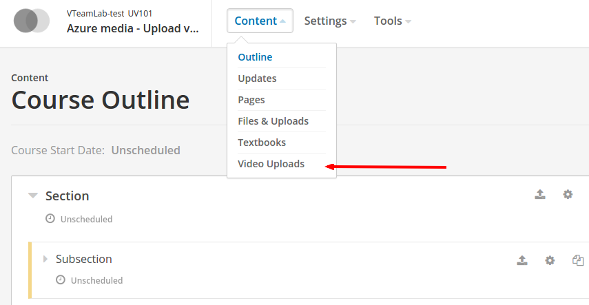
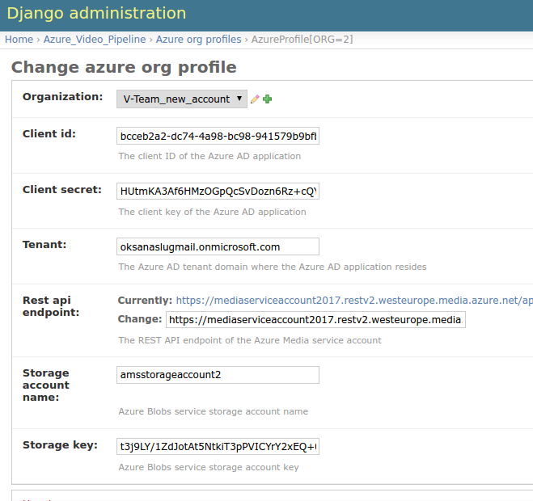
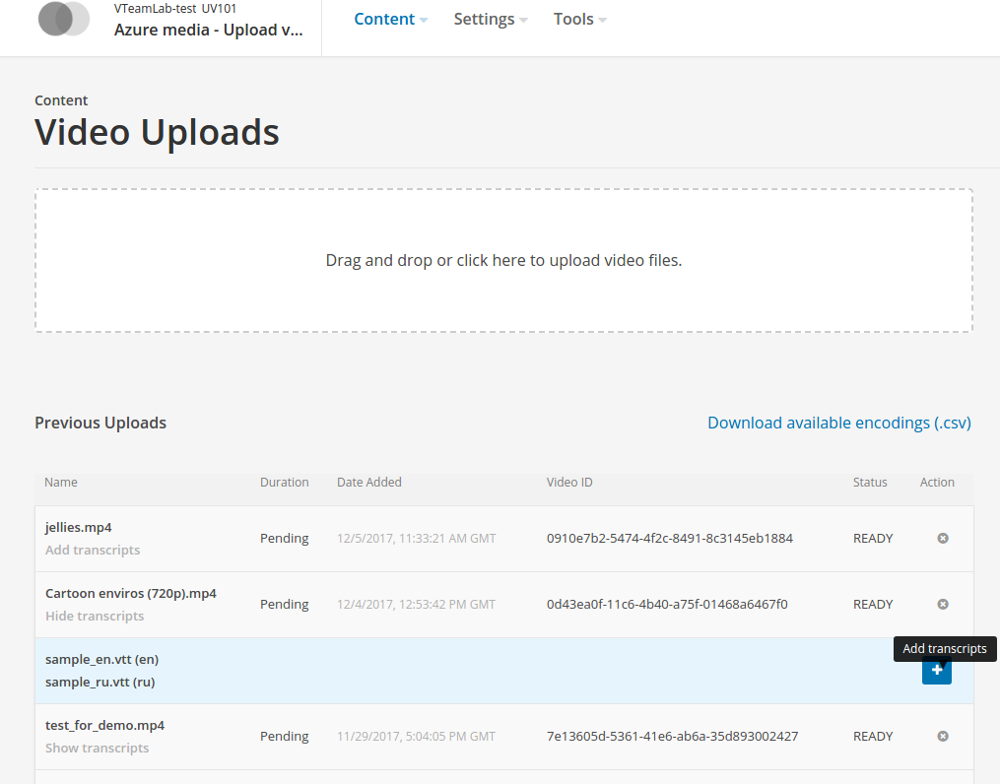
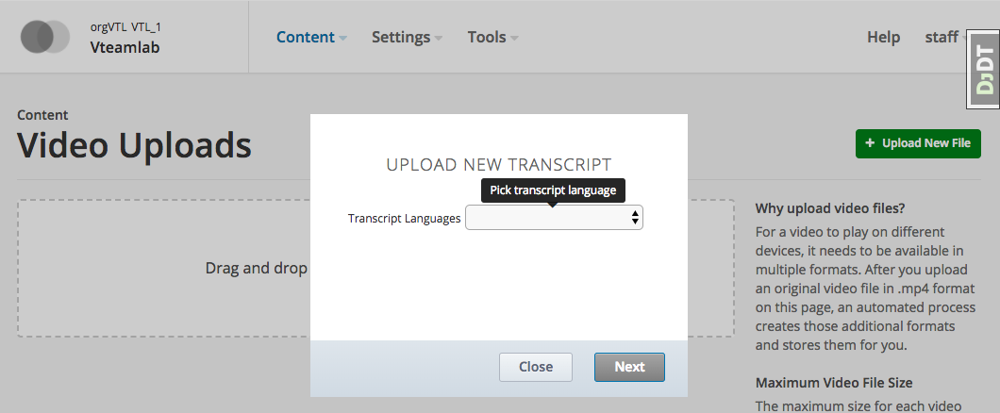

[](https://circleci.com/gh/raccoongang/azure-video-pipeline/tree/master)
[](https://codecov.io/gh/raccoongang/azure-video-pipeline)

## DEPRECATED - DON'T USE.

# azure-video-pipeline
Provides ability to use MS Azure services as OpenEdx video upload, processing and delivery backend.

Azure Video Pipeline (AVP) is a Django application that aims to extend existent edx-platform course video upload
functionality - adds ability to use Azure service as alter backend for video storage, processing (encoding, encrypting)
and delivery (streaming, downloading).

Azure services that are involved:
- Azure Active Directory - API app authorization;
- Azure Blob Service - content storage;
- Azure Media Service - processing, delivery

AVP relies on the [edx-organizations](https://github.com/edx/edx-organizations) to make it possible to attach
Azure profile to certain Edx Organization, but global (installation-wide) settings also may be configured as
fallback.

# Configuration

The configuration process include two steps:
- OpenEdx platform configuration;
- Azure portal (dashboard) configuration.

## OpenEdx configuration

### Enabling Video Uploads

To enable video upload feature for Azure provide following settings:
```
# cms.env.json
FEATURES['ENABLE_VIDEO_UPLOAD_PIPELINE'] = 'azure'
```
This setting opens extra Content menu item `Video Uploads` and video uploads page accordingly.



### Attaching Azure account to Organization

In order to configure Azure backend for Organization one should create AzureOrgProfile within Studio (aka CMS) admin site:

```
NOTE: migration should be performed in order to make available azure-video-pipeline application's AzureOrgProfile model.

/admin/azure_video_pipeline/azureorgprofile/
```
Azure organization profile contains all needed information to make it possible to:
- upload videos and transcripts to Azure;
- encode uploaded video (make a bulk of video files 'with different quality');
- encrypt encoded video (optional);
- stream encoded \[encrypted\] video to be consumed by Azure Media Player;

Please, refer to fields' informative help text.



## Azure configuration

### AD (Active Directory)

To be able to communicate with Azure services AD application (with `Web app / API` type) must be created and configured
which ID and key secret are used in AzureOrgProfile as `Client ID` and `Client secret` respectively.
Data for `Tenant` setting may be found in AD/Properties/Directory ID.

### Blob service

Storage account must be created and configured. Account name and key are used in AzureOrgProfile
as `Storage account name` and `Storage key` respectively.

#### CORS

`CORS` should be configured to allow: OPTIONS, HEAD, GET, POST, PUT for all origins.

### Media service

Media service account must be created and configured.
Streaming endpoint should be in `running` status (it is stopped by default).
API access utilises `service principal` type.

# Usage

## Transcripts

This application also provides new feature for video uploads page - ability to add transcripts for video.
Transcript files are stored next to its video files on Azure.

To attach transcript file to certain video file:
- click `Add trancripts` button under the video's name (if there are no transcripts yet)
 or `plus` button in transcripts section (if at least one transcript already attached);
- in modal window: pick appropriate language for transcript file to be uploaded and click `next`;
- choose transcript file from local file system (only `.vtt` transcript files are allowed).

See screenshots for clarity:




